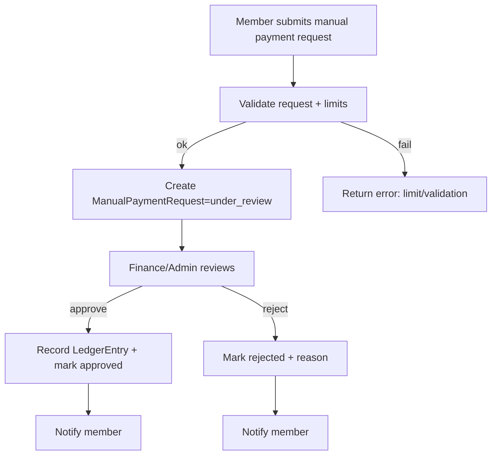
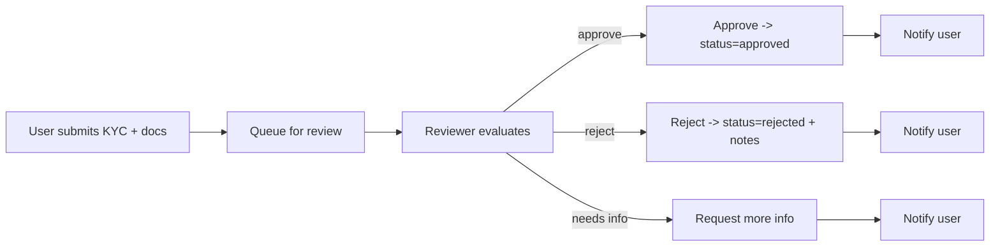
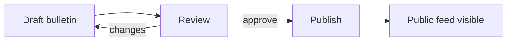
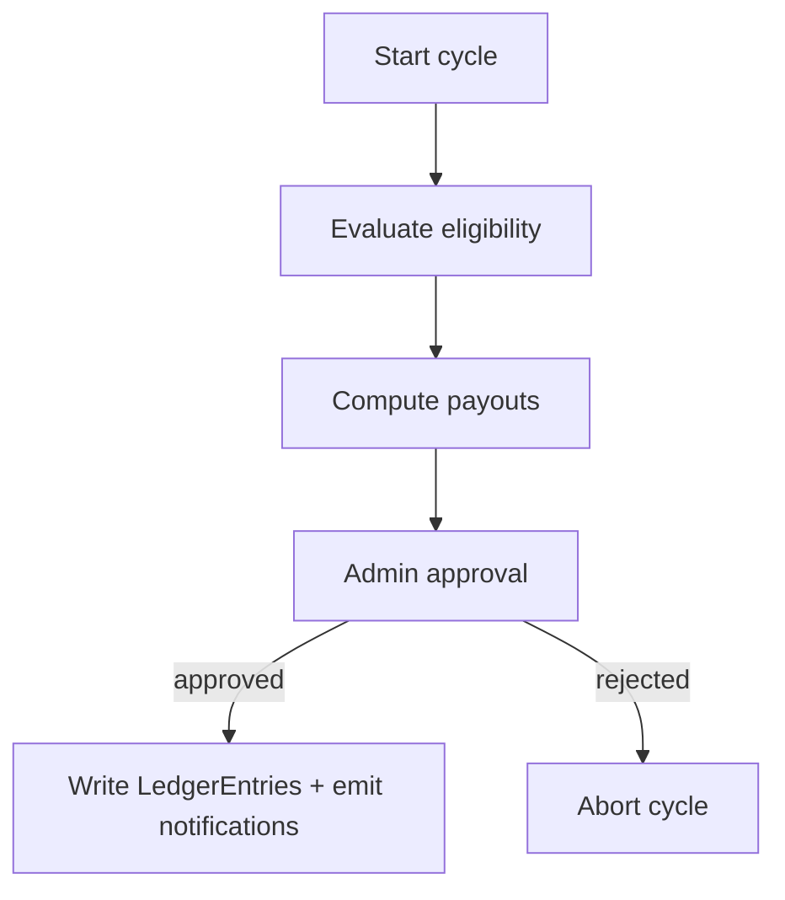
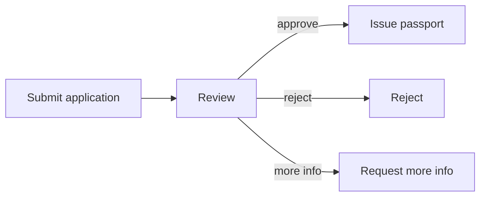

# Cocoon Hub Backend — Todolist and Flowcharts

This document tracks features, milestones, and decision context for the Cocoon Hub backend. It also outlines high-level flows to keep implementation consistent across modules.

## Decisions Snapshot
- **Stack**: TypeScript + NestJS, Next.js frontend
- **PaaS**: Faster launch (recommend Railway)
- **DB/Cache**: PostgreSQL + Redis
- **Storage**: Cloudflare R2 (S3-compatible)
- **Payments (v1)**: Manual: BDO, GCash, Maya, BPI, UnionBank; admin-configurable enable/disable and limits
- **KYC (v1)**: Manual review; AI analysis later
- **Web3**: Ethereum + Cardano (later)
- **CMS**: Internal Bulletins module (v1)

---

## Phase Checklist
- [x] Phase 0: Repo scaffold, health, API prefix, CORS, envs, Dockerfile/Compose
- [ ] Phase 1: Config, Validation, Swagger; Auth/RBAC baseline; Prisma wiring and initial migration
- [ ] Phase 2: Payments (manual) + Admin RBAC; KYC (manual) + storage; Bulletins v1
- [ ] Phase 3: UBI Engine v1 (programs, cycles, ledger) + Admin pages
- [ ] Phase 4: Events + SSBA (courses, cohorts, certificates)
- [ ] Phase 5: Store (products, orders) + payments linkage
- [ ] Phase 6: AR Passport (manual review + lifecycle)
- [ ] Phase 7: Web3 (wallet linking + metaverse cards, read-only)
- [ ] Phase 8: Hardening, observability, compliance pass, backups/runbooks

---

## Platform Foundations
- [x] Health endpoint `GET /api/health` (`src/health/...`)
- [x] Global API prefix `/api` and CORS enabled (`src/main.ts`)
- [x] `.env.example`
- [x] Docker: `Dockerfile`, `docker-compose.yml` (Postgres 16, Redis 7)
- [x] Prisma schema file (`prisma/schema.prisma`) — initial models
- [x] Prisma module/service wired (migrations pending)
- [ ] Initial migration
- [x] ConfigModule (`@nestjs/config`) and typed config
- [x] Global ValidationPipe (`class-validator`, `class-transformer`)
- [x] Swagger at `/api/docs` (`@nestjs/swagger`)
- [ ] GitHub Actions CI (lint, typecheck, tests, build, prisma migrate)

---

## Auth & RBAC
- [ ] Register/login with email/password (Argon2id)
- [ ] JWT access + refresh tokens, rotation & revocation
- [ ] OAuth (Google/Apple) — optional later
- [x] Roles: `admin`, `reviewer`, `finance`, `member`
- [x] Guards/decorators for RBAC and entitlements (header/JWT payload based in dev)
- [ ] Audit logs for admin/finance actions

---

## Memberships & Tiers
- [ ] Models: `MembershipTier`, `UserMembership`, entitlements JSON
- [ ] Admin assign/modify membership
- [ ] Entitlement checks middleware/guard integration

---
## Payments (Manual, v1)
- [x] Baseline endpoints scaffolded in `src/payments/...`
  - `GET /api/payments/banks` — list banks and config
  - `POST /api/payments/banks/config` — set enable/disable + dailyLimit (admin-only later)
- [x] Models: `Bank`, `BankConfig`, `ManualPaymentRequest`, `LedgerEntry`
- [x] Admin UI/API: enable/disable, set limits per bank
- [x] Manual payment request lifecycle: submitted → under_review → approved/rejected
- [x] Enforce limits in validators/guards
- [x] Ledger entries on approval
- [ ] Ledger entries on refund

Flow (Manual Payment)

---

## KYC (Manual, v1)
- [x] Scaffold endpoints `src/kyc/...`
  - `POST /api/kyc/apply`
  - `GET /api/kyc/applications`
  - `PATCH /api/kyc/applications/:id/status`
- [x] Models: `KycApplication`, `KycDocument`
- [x] Cloudflare R2: presigned upload URLs for documents (placeholder)
- [x] Reviewer role and restricted endpoints
- [x] Notes & audit trail on decisions

Flow (KYC Manual Review)

---

## Bulletins (Internal CMS v1)
- [x] Scaffold controller `src/bulletins/...` with `GET` and `POST`
- [x] Models: `Bulletin(id, title, body, status, publishedAt)`
- [x] Admin-only: create/publish/unpublish endpoints gated
- [x] Public feed: `GET /api/bulletins` returns published only
- [x] Optional: content versioning

Flow (Bulletin Publish)

---

## UBI Engine v1
- [x] Models: `UbiProgram`, `UbiEnrollment`, `UbiCycle`, `UbiPayout`, `LedgerEntry`
- [x] Define program rules JSON + eligibility (simple: all enrolled)
- [ ] Schedule cycles (BullMQ) and compute payouts (auto)
- [x] Approvals + ledger writes
- [x] Member `GET /api/me/ubi/ledger`

Flow (UBI Cycle)

---

## Events
- [x] Models: `Event`, `Registration`
- [x] `GET /api/events` list
- [x] Register/waitlist; check-in endpoint
- [ ] Reminders/notifications

---

## SSBA (Academy)
- [x] Models: `Course`, `Cohort`, `Enrollment`, `Certificate`
- [x] Enrollment + progress
- [x] Certificate issuance (DOCX) to R2 (presigned upload)

---

## Web3 (Later)
- [ ] Wallet linking (SIWE for Ethereum; Cardano 
address verification strategy TBD)
- [ ] Metaverse Cards issuance/lookup
- [ ] Read-only on-chain proofs via RPC (Alchemy/Infura)

---

## Store
- [x] Models: `Product`, `Order`, `OrderItem`
- [x] Pricing/tax basics (order totals computed from product taxRatePct)
- [ ] Checkout flow (ties to payments when automated)

---

## AR Passport
- [ ] Models: `PassportApplication`
- [ ] Document upload (R2), statuses, notes
- [ ] Reviewer/admin lifecycle

Flow (AR Passport)

---

## Notifications
- [ ] Template system (email/SMS)
- [ ] Providers: SendGrid/Twilio
- [ ] Audit logs and retries

---

## Admin APIs
- [ ] User management, role assignment
- [ ] Finance ops (payments manual)
- [ ] KYC review
- [ ] Content moderation (bulletins)
- [ ] Audit logs access

---

## Observability
- [ ] JSON structured logs (pino)
- [ ] OpenTelemetry tracing
- [ ] Metrics (Prometheus format)
- [ ] Error monitoring (Sentry)

---

## Security & Compliance
- [ ] Argon2id password hashing
- [ ] JWT short TTL + refresh rotation
- [ ] Per-route rate limiting
- [ ] CORS allowlist
- [ ] PII encryption at rest (DB KMS configs per PaaS)
- [ ] Data retention + deletion policies

---

## DevOps & Deployment
- [ ] GitHub Actions CI (lint, test, build, prisma migrate)
- [ ] Railway service with env var mappings
- [ ] Backup policies (DB snapshots), runbooks
